<h1 align="center">CodeArt</h1>


<div align="center">
  <a href="https://github.com/artart222/CodeArt/blob/main/LICENSE">
    
  </a>

  

  <!--
  <a href="https://discordapp.com/channels/875388658637754428">
    
  </a>
  -->

  <a href="https://github.com/artart222/CodeArt/issues">
    
  </a>

  <a href="https://github.com/artart222/CodeArt/pulse">
    
  </a>
</div>


<h2>Install CodeArt easily</h2>

On linux:
```bash
sudo pip3 install distro
python3 install.py
```

On windows/mac:
```bash
python3 install.py
```


<h2>Install lsp and treesitter</h2>
<ul>
  <li>You can install lsp for a language with <kbd>:LspInstall &ltlanguage&gt</kbd></li>
  <li>and you can install treesitter with <kbd>:TSInstall &ltlanguage&gt</kbd></li>
</ul>

<p>for completing instalation you must run <kbd>:call mkdp#util#install()</kbd> to add markdown preview support</p>


<h2>Screenshots:</h2>
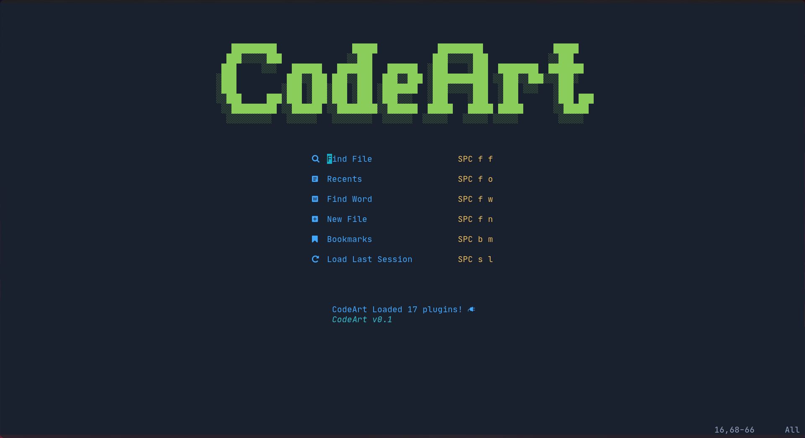

<h2>Many themes!</h2>
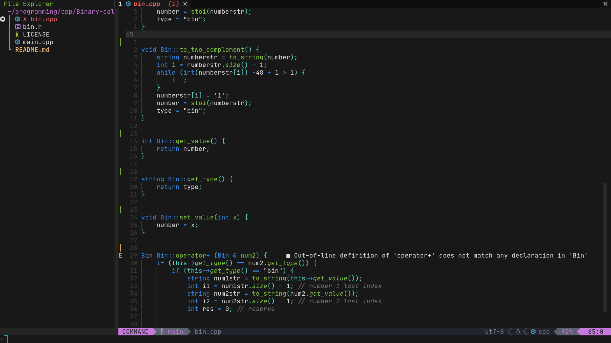
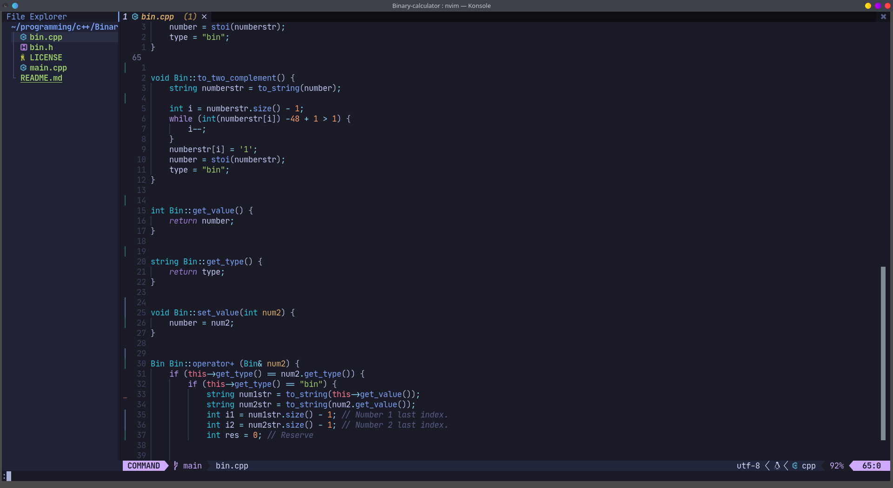
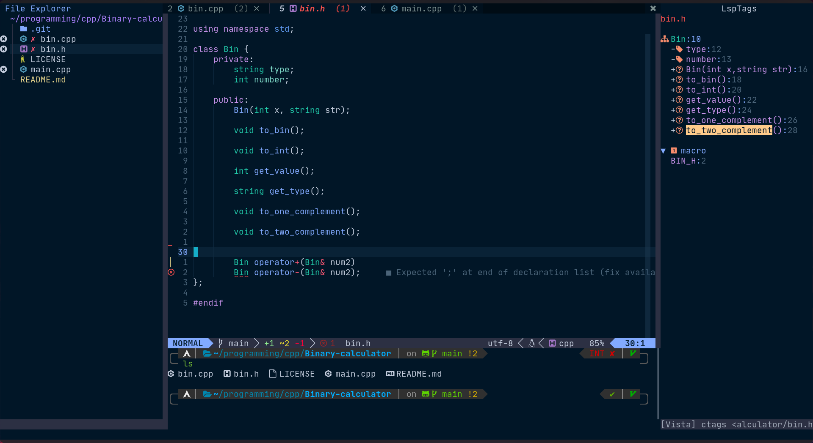

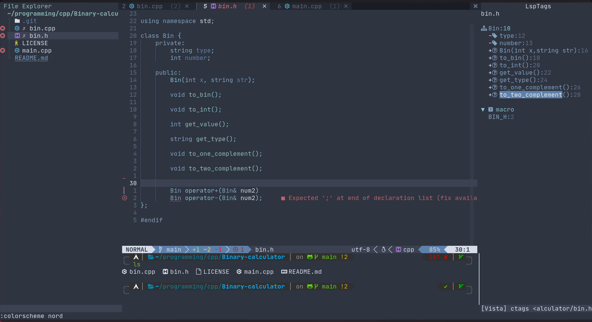
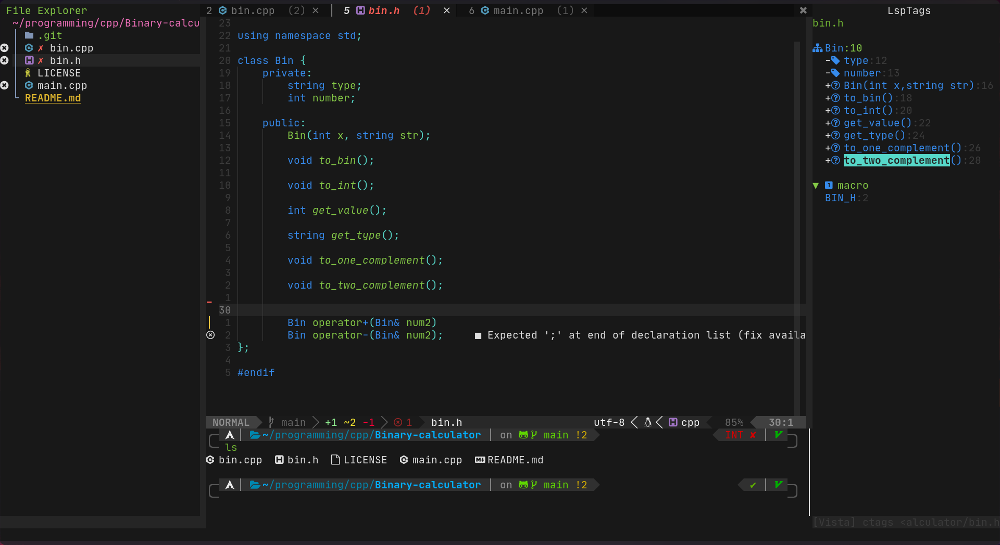
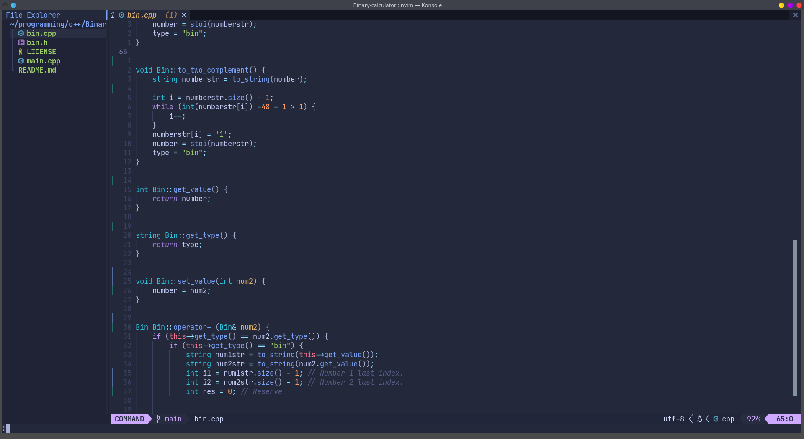
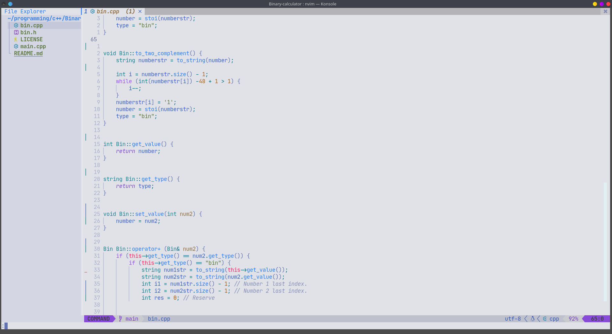
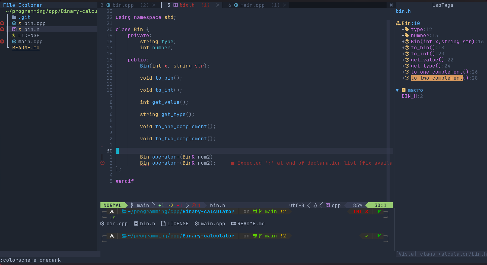
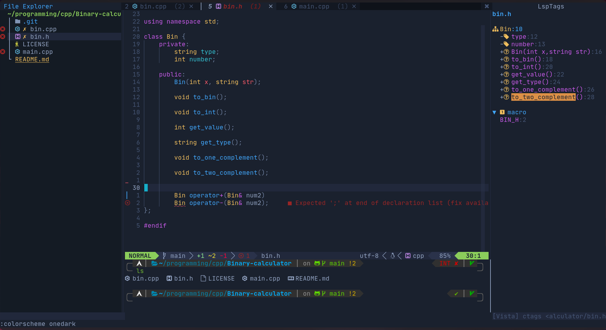
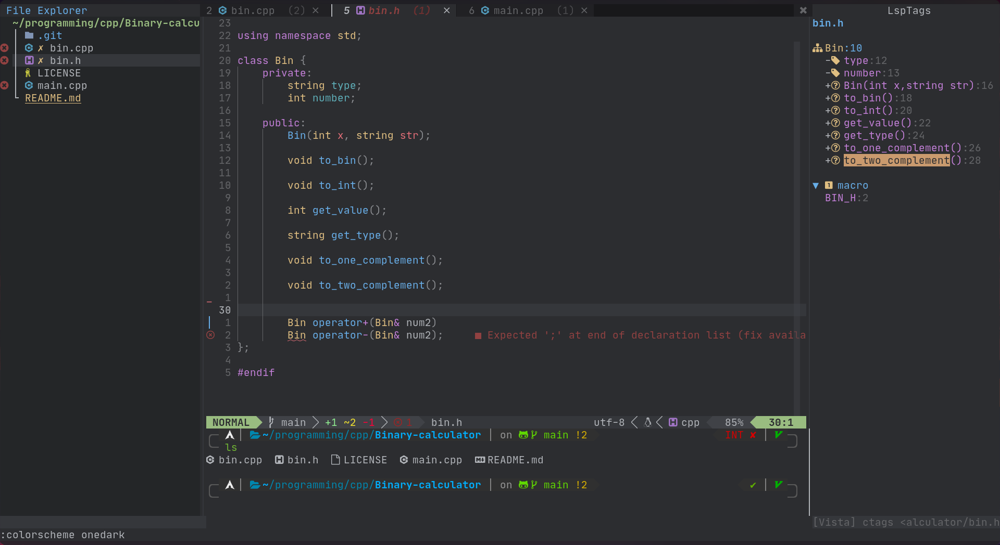
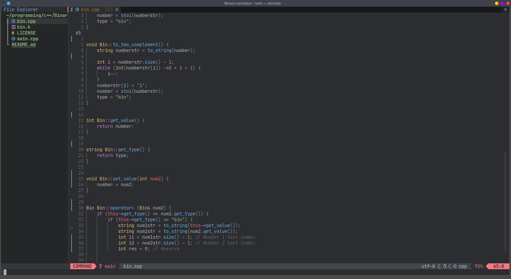
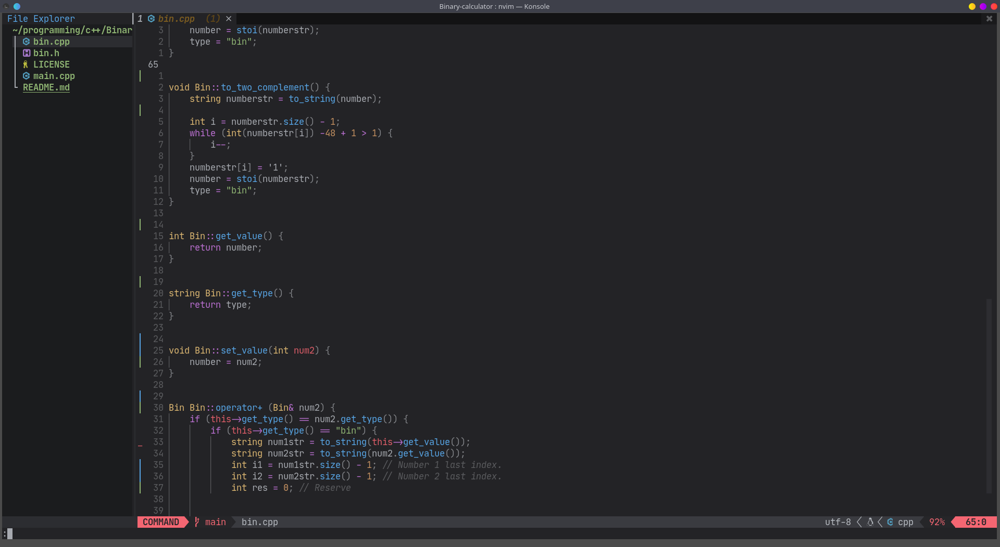
